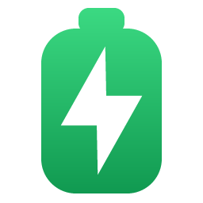
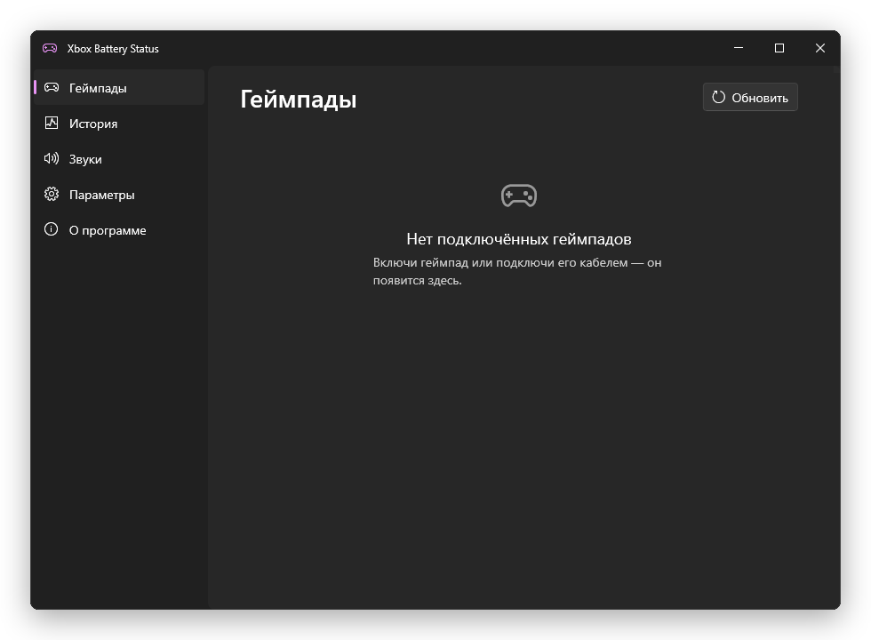
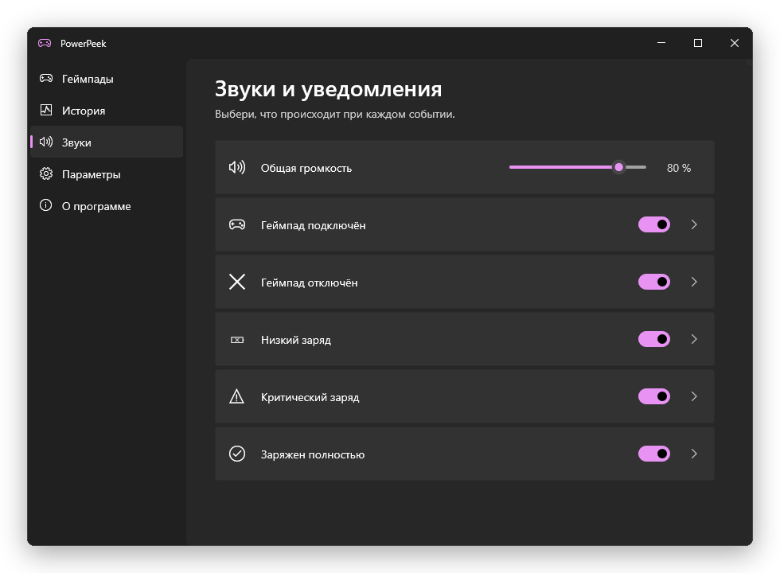
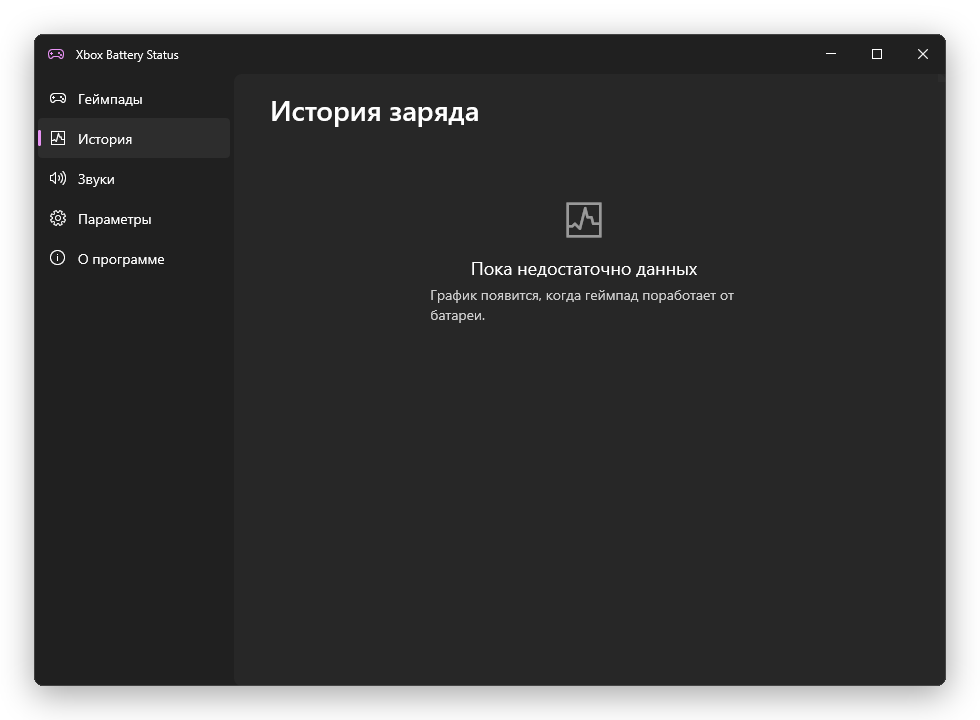
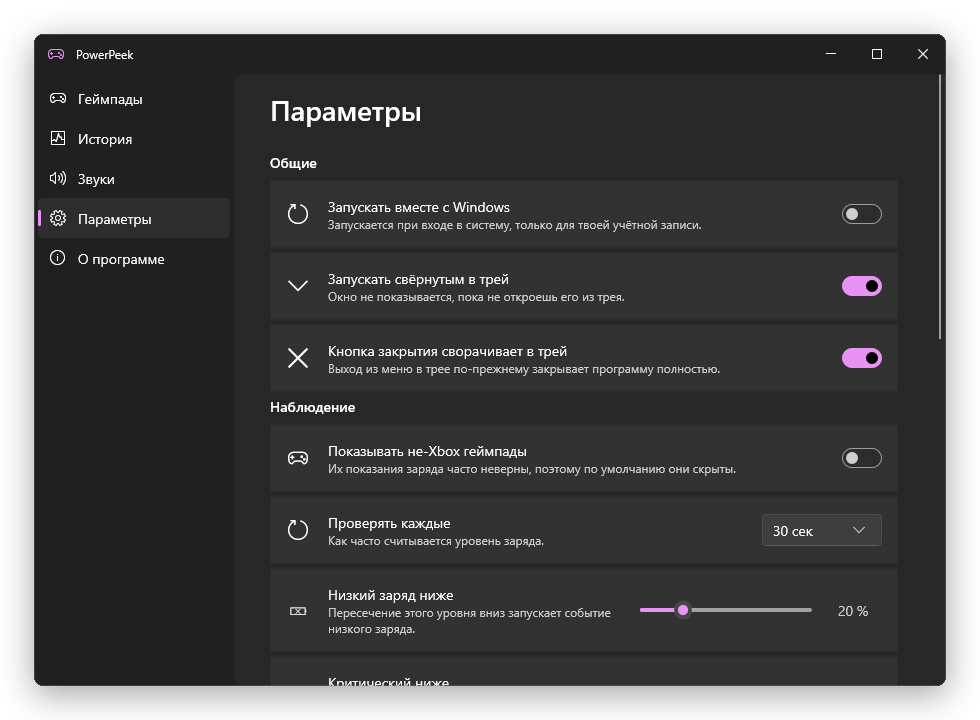
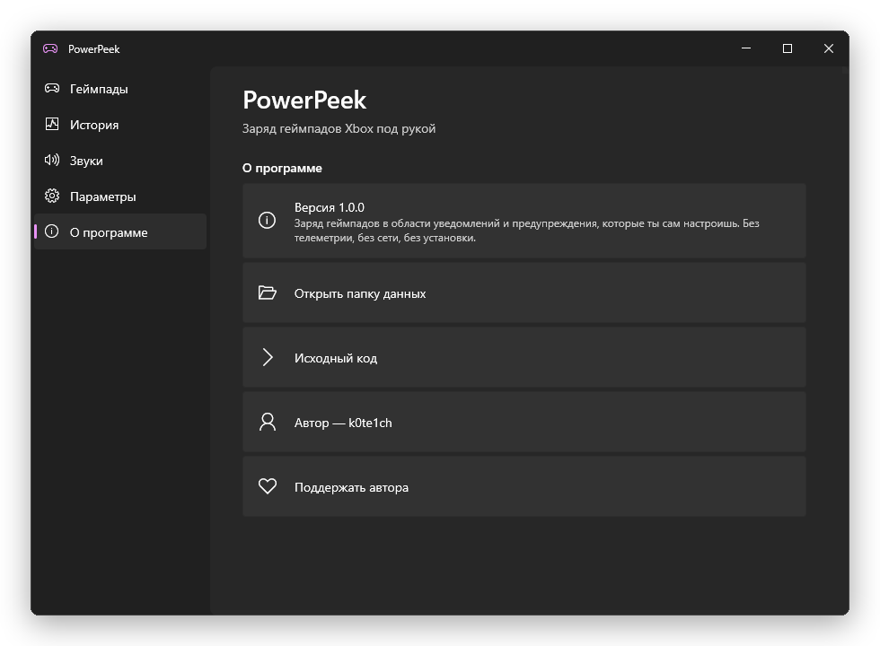

<div align="center">



# PowerPeek

**Your controller's battery, in the notification area — with the warnings you actually want.**

[](https://github.com/k0te1ch/powerpeek/actions/workflows/ci.yml)
[](https://github.com/k0te1ch/powerpeek/releases/latest)
[](https://github.com/k0te1ch/powerpeek/releases)
[](LICENSE)
[](#requirements)
[](#building-from-source)

**English** · [Русский](README.ru.md)



</div>

---

## Why this exists

Windows knows your controller's battery level. It just will not tell you unless you open the Xbox
Accessories app and keep it open.

This puts the level in the notification area, keeps it there, and makes a noise before the controller
dies instead of after. It is one 4 MB executable with nothing to install, no runtime, no service, and
no network code.

## Features

|   | |
|---|---|
| **Live tray icon** | Drawn at runtime rather than chosen from a set of prebuilt images — a battery, a ring gauge or a plain percentage, in your theme and accent colour, at whatever size the shell asks for. With several pads connected it shows the lowest level and how many there are. |
| **Sounds you choose** | Five events — connected, disconnected, low, critically low, fully charged — each with its own sound file, its own volume, and a Test button. WAV, MP3, FLAC, M4A. Five built-in chimes ship inside the executable. |
| **Two kinds of notification** | The app's own Fluent card, which never steals focus from a game, and real Windows notifications that land in the Action Center. Per event, independently. |
| **Battery history** | A chart of how each controller drains, the drain rate, and an estimate of how long is left. |
| **A window that belongs on Windows** | Custom-drawn Fluent chrome, light and dark themes that follow the system, per-monitor DPI, and animation that costs nothing when nothing is moving. |
| **A tray icon you can colour** | Automatic contrast against your taskbar by default — which matters, because a taskbar tinted with your accent swallows an accent-coloured mark — or the system accent, or a colour you pick. Low and critical keep their amber and red regardless. |
| **English and Russian** | Follows your Windows display language, or pick one. |
| **Nothing leaves your machine** | No telemetry, no accounts, no network code at all. |

## Screenshots

<div align="center">

| Sounds | History |
|:---:|:---:|
|  |  |
| **Settings** | **About** |
|  |  |

</div>

## Install

Download `PowerPeek.exe` from the [latest release](https://github.com/k0te1ch/powerpeek/releases/latest)
and run it. That is the whole installation — it is a single self-contained executable, and it will
keep working from wherever you put it.

An installer is also built for each release, for a Start menu entry and an uninstall entry; the
portable executable and the installed copy are the same program and share the same settings.

To have it start with Windows, turn on **Start with Windows** in Settings.

To remove the portable copy: quit from the tray menu, delete the executable, and delete
`%LOCALAPPDATA%\PowerPeek` if you want its settings gone too.

## Requirements

- Windows 10 version 1809 or newer, 64-bit. Windows 11 is fully supported and picks up its rounded
  window corners automatically.
- An Xbox controller: Xbox One, Xbox Series, Elite, Elite Series 2 or Adaptive, over USB, the Xbox
  Wireless Adapter or Bluetooth.

Third-party pads can be shown too — there is a setting for it — but their battery readings are
frequently wrong, which is why they are hidden by default.

## Building from source

You need Visual Studio 2022 with the **Desktop development with C++** workload. That brings the
Windows SDK, CMake and Ninja with it, and there is nothing else to install: the project has no
external dependencies whatsoever.

```bash
git clone https://github.com/k0te1ch/powerpeek.git
cd powerpeek
tools\build.bat release
```

The result is `build\release\PowerPeek.exe`.

| Command | What it does |
|---|---|
| `tools\build.bat release` | Optimised build |
| `tools\build.bat debug` | Debug build |
| `tools\syntax-check.bat src\ui\Widgets.cpp` | Compiles one file, for a fast edit loop |
| `python tools\generate_assets.py` | Regenerates the icon and the built-in sounds |

## Where your settings live

```
%LOCALAPPDATA%\PowerPeek\
    settings.json      your settings
    history.jsonl      battery history
    PowerPeek.log
```

Deleting that folder resets everything to defaults.

## FAQ

<details>
<summary><b>Why does the percentage move in big jumps instead of smoothly?</b></summary>

Because that is all the controller actually reports. The Xbox wire protocol carries a two-bit battery
level, so the "precise" figure Windows exposes is a reconstruction with roughly four distinct steps.

This app shows a percentage because it is the most readable form, but it marks it as approximate, plots
history as the real transitions rather than an invented smooth curve, and never pretends to a precision
it does not have. Anything that shows you "73.4%" is telling you a story.
</details>

<details>
<summary><b>My controller is plugged in and shows no battery level. Is that a bug?</b></summary>

No. A wired controller, and a wireless one running off a cable without a battery pack, genuinely has no
battery to report. It is shown as *wired* rather than as 0%, because treating "no battery" as "empty
battery" is exactly what makes other battery monitors shout about a controller that is perfectly happy.

If you have a Play & Charge pack fitted, you will see a level and a charging state.
</details>

<details>
<summary><b>Do I need the Xbox app, Game Bar or any driver?</b></summary>

No. It uses the controller support already built into Windows.
</details>

<details>
<summary><b>Windows notifications do not appear, but the app's own ones do.</b></summary>

Windows only shows notifications for desktop apps it can identify, which requires a Start menu entry.
The app creates one on first run; if your system or your policies prevent that, Windows notifications
are unavailable and the app says so in its settings. Its own notification cards keep working either
way — and they have the advantage of never stealing focus from a game.
</details>

<details>
<summary><b>Can I use my own sounds?</b></summary>

Yes — that is rather the point. Each of the five events takes its own file: WAV, MP3, FLAC, M4A, or
anything else you have a codec for. Each has its own volume and a Test button, and Reset puts the
built-in chime back.
</details>

<details>
<summary><b>Why is a small utility 4 MB?</b></summary>

It links the C runtime statically so it runs on any machine with nothing installed, and the five
built-in sounds are embedded in the executable. Both are deliberate: the alternative is an installer
and a redistributable, for a program that should be one file you can drop anywhere.
</details>

<details>
<summary><b>Does it phone home?</b></summary>

No. There is no network code in the project at all, no telemetry, no update check, no accounts. The
battery history is a file on your disk and nothing reads it but the app.
</details>

<details>
<summary><b>Does it support PlayStation or other controllers?</b></summary>

They will appear if you turn on "Show non-Xbox gamepads", and some report a usable level. Many report
nonsense, which is why the setting is off by default. Xbox controllers are what this is built and
tested for.
</details>

## Contributing

Issues and pull requests are welcome.

- **Build it first.** `tools\build.bat release` must stay warning-free.
- **Conventional Commits.** `feat:`, `fix:`, `docs:`, `refactor:`, `perf:`, `test:`, `build:`, `ci:`,
  `chore:`. The PR title becomes the commit on `main` and drives the version bump, so it has to be a
  valid Conventional Commit too.
- **No new dependencies.** The Windows SDK is the entire dependency list, and keeping it that way is a
  feature, not an accident.
- **All user-visible text goes in `src/core/Strings.h`** with both English and Russian filled in — a
  missing translation is a compile error, not a runtime surprise.
- **Match the surrounding style.** Comments explain *why*; the code says *what*.

A short tour of the layout:

| Directory | What lives there |
|---|---|
| `src/core` | Settings, JSON, logging, paths, localisation |
| `src/battery` | Reading controller charge, detecting events, history |
| `src/audio` | Decoding sound files and playing them |
| `src/notify` | Turning an event into a sound, a card and a toast |
| `src/platform` | Autostart, single instance, system theme, shell integration |
| `src/ui` | Rendering: device, theme, window, widgets, drawing, pages |

## Support the author

PowerPeek is written by **[k0te1ch](https://github.com/k0te1ch)** and given away under the GPL.

If it saved you a dead controller mid-match, a star on the repository is genuinely useful — it is
how anyone else finds it. If you would like to go further, there is a
[Boosty page](https://boosty.to/k0te1ch). Neither is expected, and nothing in the application is
withheld behind either.

## Licence

[GPL-3.0-or-later](LICENSE).
